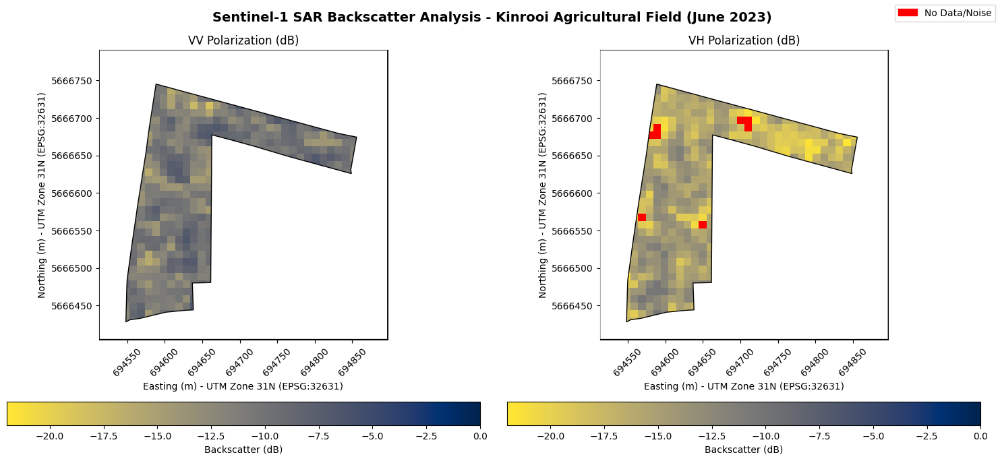

# Automated Sentinel-1 Data Processing for Soil Moisture Analysis

This project is the foundational data processing pipeline for a Master's thesis titled "Assimilation of Sentinel-1 Soil Moisture into SWIM² for Irrigation Scheduling in Belgian Arable Fields".

The primary purpose of this script is to automate the retrieval and pre-processing of Sentinel-1 Ground Range Detected (GRD) satellite data for a specific agricultural study site. It leverages the **Copernicus Data Space Ecosystem (CDSE)** and its powerful **Sentinel Hub Process API** to acquire analysis-ready data, bypassing the need for manual downloads and local processing with specialized software like ESA's SNAP toolbox.

## Display



## Project Purpose

The goal is to obtain terrain-corrected, calibrated SAR backscatter data (VV and VH polarizations) for a precise, user-defined agricultural polygon. This processed data serves as the direct input for the subsequent scientific steps of the thesis, which include:
1.  Short-Term Change-Detection
2.  Residual Vegetation & Roughness Correction
3.  Dielectric Inversion to Volumetric Soil Moisture (θ)
4.  Uncertainty Quantification and model assimilation.

## Key Features

-   **Secure Credential Management:** Uses a `.env` file to securely manage API credentials, keeping them out of source code.
-   **Cloud-Based Pre-Processing:** All heavy pre-processing (orthorectification, thermal noise removal, radiometric terrain correction) is performed on-demand by the Sentinel Hub - Process API servers.
-   **Analysis-Ready Output:** The script retrieves a multi-band GeoTIFF file containing floating-point linear power values.
-   **Interactive & Visual:** Designed for interactive execution in IDEs like VS Code, with a final step that visualizes the processed backscatter data using Matplotlib.

## Workflow Overview

The script (`process_scene.py`) executes the following workflow through 5 main cells:

### Cell 1: Library Import & Credential Setup
-  **Secure Credential Management:** Uses `python-dotenv` library to load `CLIENT_ID` and `CLIENT_SECRET` from a `.env` file, keeping sensitive credentials out of the shared codebase.
-  **Library Imports:** Imports essential libraries for OAuth authentication, raster processing, and visualization.

### Cell 2: Authentication
-  **OAuth2 Flow:** Implements the authentication process following [Copernicus CDSE documentation](https://documentation.dataspace.copernicus.eu/APIs/SentinelHub/Overview/Authentication.html).
-  **Token Management:** Uses `requests-oauthlib` library to handle OAuth2 token acquisition and management automatically.

### Cell 3: Request Configuration  
-  **Bounding Box Definition:** Defines the precise study area coordinates (can be generated using the [Copernicus Request Builder](https://documentation.dataspace.copernicus.eu/APIs/SentinelHub/UserGuides/BeginnersGuide.html#requests-builder)).
-  **Evalscript Processing:** Implements the simplest evalscript version that extracts VV, VH polarizations and dataMask in FLOAT32 format for maximum precision.
-  **Advanced Processing Parameters:**
    -   **Terrain Correction:** Uses `GAMMA0_TERRAIN` backscatter coefficient, which corrects for both incident angle and actual terrain using the Copernicus 30m DEM.
    -   **Output Resolution:** Configured for 10m×10m spatial resolution in the final GeoTIFF output.
    -   **Coordinate System:** Processes data in EPSG:32631 (UTM Zone 31N) for metric-based analysis.

### Cell 4: Data Retrieval
-  **API Request Execution:** Sends the configured request to Sentinel Hub Process API and receives processed GeoTIFF data directly in memory.

### Cell 5: Analysis & Visualization  
-  **Raster Processing:** Uses `rasterio` to handle the in-memory GeoTIFF data without temporary file creation.
-  **Data Quality Control:** 
    -   Applies `dataMask` to exclude no-data areas
    -   Implements noise masking with -22 dB threshold based on Sentinel-1 Noise Equivalent Sigma Zero (NESZ) specifications from [SentiWiki](https://sentiwiki.copernicus.eu/web/s1-mission)
-  **Visualization:** Converts linear power values to decibels (dB) and displays VV and VH polarizations using matplotlib. Masking is done by using the Kinrooi Field .shp file in the input folder and making white layer and a hole following the vector shape.

## Setup and Installation

Follow these steps to set up the project environment.

### 1. Prerequisites

You must have a registered account on the Copernicus Data Space Ecosystem.
-   **Registration:** [Create an account here](https://documentation.dataspace.copernicus.eu/Registration.html).

### 2. Clone the Repository

```bash
git clone <your-repository-url>
cd <your-repository-directory>
```

### 3. Set Up Python Environment

It is highly recommended to use a Python virtual environment to manage dependencies.

```bash
# Create a virtual environment
python -m venv venv

# Activate it (macOS/Linux)
source venv/bin/activate

# Activate it (Windows)
.\venv\Scripts\activate
```

### 4. Install Dependencies

The required libraries are listed in `requirements.txt`. To install it, run below in the command line.

```bash
pip install -r requirements.txt
```

### 5. Configure Credentials

Your script needs API credentials to access Copernicus data.

1.  **Generate Credentials:** Follow the official guide to create an OAuth Client and get your `Client ID` and `Client Secret`:
    -   **Guide:** [Registering an OAuth Client](https://documentation.dataspace.copernicus.eu/APIs/SentinelHub/Overview/Authentication.html#registering-oauth-client)

2.  **Create `.env` file:** In the root of the project, create a file named `.env`.

3.  **Add Credentials to `.env`:** Open the `.env` file and add your credentials in the following format:
    ```
    CLIENT_ID="sh-5923508d-3b7e-578e-addd-533235614798"
    CLIENT_SECRET="5NPnWfw2NrBblkp8bhJyKOtm68H8bt5"
    ```

### 6. Secure Your Credentials

If you ever need to publish your own modified version of this project, you shouldn't share your credential. To ensure your `.env` file is never committed to Git, create a `.gitignore` file in the root of your project and add the following lines:

```
# .gitignore
.env #Credential file
venv/ #Environment folder
```

## Usage

The script is designed for interactive, cell-by-cell execution in an IDE that supports the `#%%` cell delimiter, such as **Visual Studio Code** with the Python extension.

1.  Open the `process_scene.py` file in VS Code.
2.  Place your cursor in the first cell (marked with `#%%`).
3.  Press `Shift+Enter` to run the current cell and move to the next.
4.  Execute each cell in sequence to see the output of each step. The final cell will display the processed SAR images.

However running the code as normal python file in any other IDE would also work.

## Official Documentation References

This project relies heavily on the official Copernicus Data Space Ecosystem documentation. For more details, please refer to the following pages:

-   **Main Portal:** [Sentinel Hub API](https://documentation.dataspace.copernicus.eu/APIs/SentinelHub.html/)
-   **Authentication:** [Sentinel Hub Authentication Guide](https://documentation.dataspace.copernicus.eu/APIs/SentinelHub/Overview/Authentication.html)
-   **Requests Builder Tool:** [A graphical tool to build API requests](https://documentation.dataspace.copernicus.eu/APIs/SentinelHub/UserGuides/BeginnersGuide.html#requests-builder)
-   **Process API:** [Primary API for data processing](https://documentation.dataspace.copernicus.eu/APIs/SentinelHub/Process.html)
-   **Sentinel-1 GRD Data:** [Details on S1 GRD bands and processing options](https://documentation.dataspace.copernicus.eu/APIs/SentinelHub/Data/S1GRD.html)
-   **Evalscript V3:** [Documentation for writing custom processing scripts](https://documentation.dataspace.copernicus.eu/APIs/SentinelHub/Evalscript/V3.html)
-   **Process API Examples:** [Official examples for various data collections](https://documentation.dataspace.copernicus.eu/APIs/SentinelHub/Process/Examples/S1GRD.html)