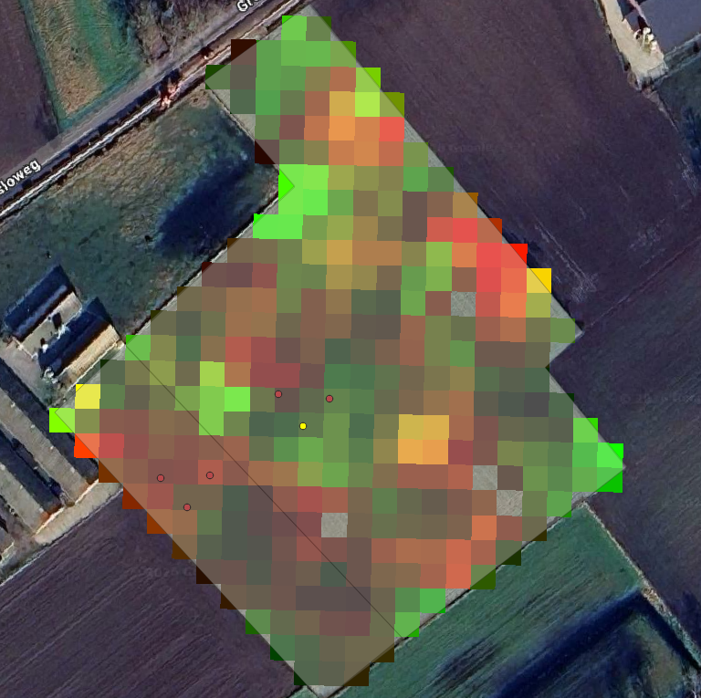
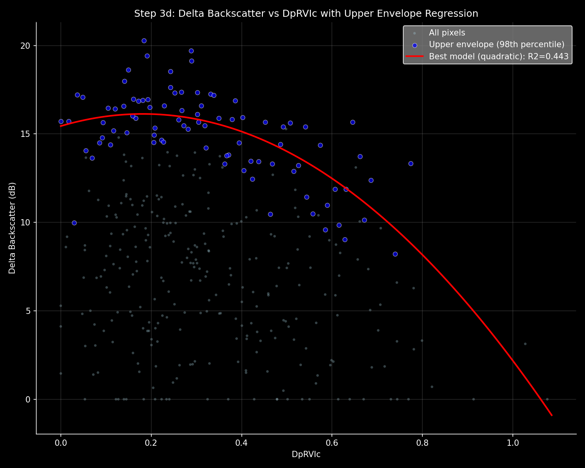
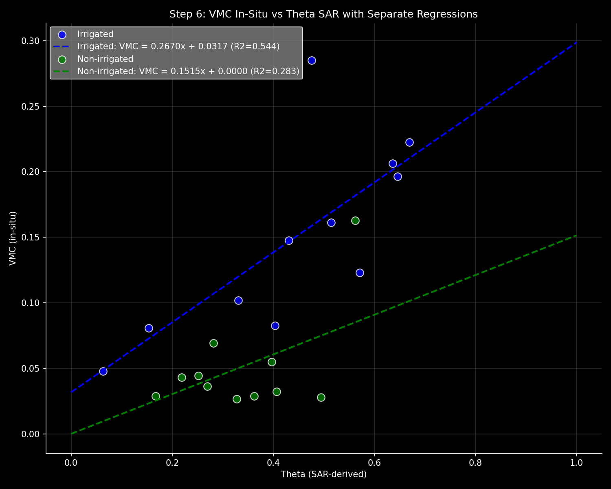
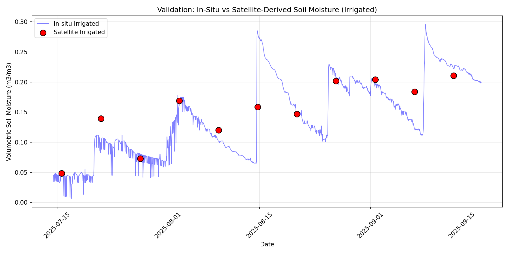
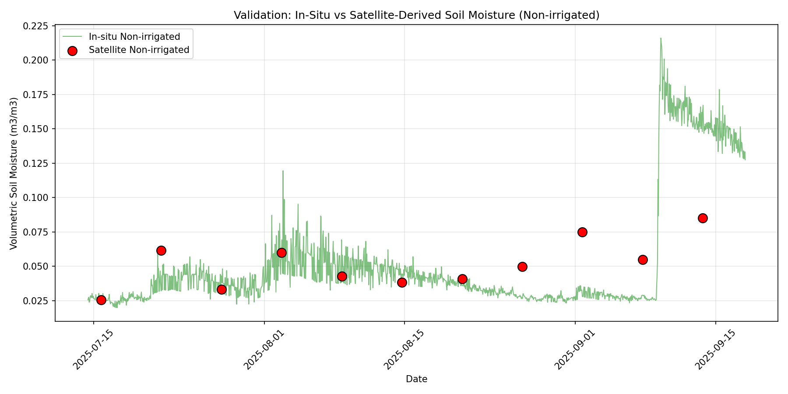

# Sentinel-1 Soil Moisture Processing Pipeline

 This project provides a complete pipeline for retrieving, processing, and analyzing Sentinel-1 SAR data to estimate soil moisture in agricultural fields. In development for a Master's thesis titled "Assimilation of Sentinel-1 Soil Moisture into SWIM² for Irrigation Scheduling in Belgian Arable Fields".

## Overview

```
sentinelproc/
├── process_all_scenes.py       # Downloads Sentinel-1 time series
├── json_to_csv.py              # Converts metadata to CSV
├── mask_farmland.py            # Masks images to farmland areas
├── soil_moisture_workflow.py   # Main SM estimation
├── evalscript.js               # Processing script
├── images/
│   └── Farmland.png            # Study area visualization
└── input/
    └── neeroeteren2025.shp     # Farmland boundaries
```

## Display



*Neeroeteren study area: irrigated and non-irrigated farmland*

---

## Part 1: Setup

### Prerequisites

1. **Copernicus Account:** [Register here](https://documentation.dataspace.copernicus.eu/Registration.html)

### Installation

```bash
# Clone repository
git clone <your-repository-url>
cd sentinelproc

# Create virtual environment
python -m venv venv
# Windows: .venv\Scripts\activate
# macOS/Linux: source venv/bin/activate

# Install dependencies
pip install -r requirements.txt
```

### Configure Credentials

Create `.env` file:
```
CLIENT_ID=your_client_id
CLIENT_SECRET=your_client_secret
```
**Guide to get this:** [Registering an OAuth Client](https://documentation.dataspace.copernicus.eu/APIs/SentinelHub/Overview/Authentication.html#registering-oauth-client)

---

## Part 2: Time Series Data Pipeline

### 2.1 process_all_scenes.py

Downloads a time series of Sentinel-1 GRD images from Copernicus Data Space API.

**Key Variables:**
```python
bbox_neeroeteren_utm = [693430, 5665633, 693680, 5665921]  # UTM Zone 31N
start_date = "2025-07-14T00:00:00Z"
end_date = "2025-09-18T23:59:59Z"
```

**Output:** `SAR_timeseries_output/*.tif` + `*.json` (metadata)

### 2.2 json_to_csv.py

Converts JSON metadata to CSV for easier analysis. Only for analysis purpose.

**Output:** `SAR_metadata.csv` (scene_id, datetime, orbit_direction, orbit number, satellite)

### 2.3 mask_farmland.py

Masks downloaded images to extract farmland areas defined in shapefile.

**Shapefile details:**
| Feature ID | Name | Area (km²) |
|-----------|------|------------|
| 1 | Overall | 3.159 |
| 2 | Non-irrigated | 0.637 |
| 3 | Irrigated | 2.515 |

**Output:**
```
{scene_id}_{orbit_direction}_{irrigated|nonirrigated}.tif
```

---

## Part 3: Soil Moisture Estimation

### 3.4 soil_moisture_workflow.py

Processes masked time series to estimate volumetric soil moisture following the aanwarigeo method.

**Workflow:**
1. Load SAR data, remove duplicate dates
2. Calculate DpRVIc vegetation index
3. Find dry reference (minimum VV_dB per pixel)
4. Calculate delta backscatter
5. Upper envelope regression with DpRVIc
6. Match with in-situ sensors
7. Constrained linear regression for calibration

**DpRVIc formula:**
```
q = VH / VV
DpRVIc = q * (q + 3) / (q + 1)^2
```

**Key Variables:**
```python
GROWING_SEASON_START = datetime(2025, 7, 14)
GROWING_SEASON_END = datetime(2025, 9, 18)
TIME_TOLERANCE_HOURS = 24
NUM_BINS = 100
PERCENTILE = 0.98
```

**Input:**
- `SAR_timeseries_masked/*.tif`
- `input/Neeroeteren2_*.csv` (6 sensor files)

**Output:**
- `output/delta_backscatter/` (22 files)
- `output/dprvic/` (22 files)
- `output/regression_dprvic.png`
- `output/regression_calibration.png`
- `output/validation_chart_irr.png`
- `output/validation_chart_nonirr.png`
- `output/soil_moisture_timeseries.xlsx`
- `output/volumetric_SSM.tif`

### Results

| Area | R² | Equation | RMSE |
|------|-----|----------|------|
| Irrigated | 0.544 | VMC = 0.267×Theta + 0.032 | 0.046 |
| Non-irrigated | 0.283 | VMC = 0.152×Theta + 0.000 | 0.032 |

### Output Visualizations

**DpRVIc Regression:**


**Calibration with In-Situ:**


**Validation - Irrigated:**


**Validation - Non-irrigated:**


---

## Quick Start

```bash
# Step 1: Set up credentials
cp .env.example .env
# Add CLIENT_ID and CLIENT_SECRET

# Step 2: Download time series
python process_all_scenes.py

# Step 3: Convert metadata to CSV
python json_to_csv.py

# Step 4: Mask to farmland
python mask_farmland.py

# Step 5: Process soil moisture
python soil_moisture_workflow.py

# Step 6: Check outputs
ls output/
```

---

## Official Documentation

- [Sentinel Hub API](https://documentation.dataspace.copernicus.eu/APIs/SentinelHub.html/)
- [Authentication Guide](https://documentation.dataspace.copernicus.eu/APIs/SentinelHub/Overview/Authentication.html)
- [Process API](https://documentation.dataspace.copernicus.eu/APIs/SentinelHub/Process.html)
- [S1 GRD Data](https://documentation.dataspace.copernicus.eu/APIs/SentinelHub/Data/S1GRD.html)
- [Evalscript V3](https://documentation.dataspace.copernicus.eu/APIs/SentinelHub/Evalscript/V3.html)

---

## References

- [aanwarigeo/sentinel-1-soil-moisture (GitHub)](https://github.com/aanwarigeo/sentinel-1-soil-moisture)

---

*Updated: April 2026*