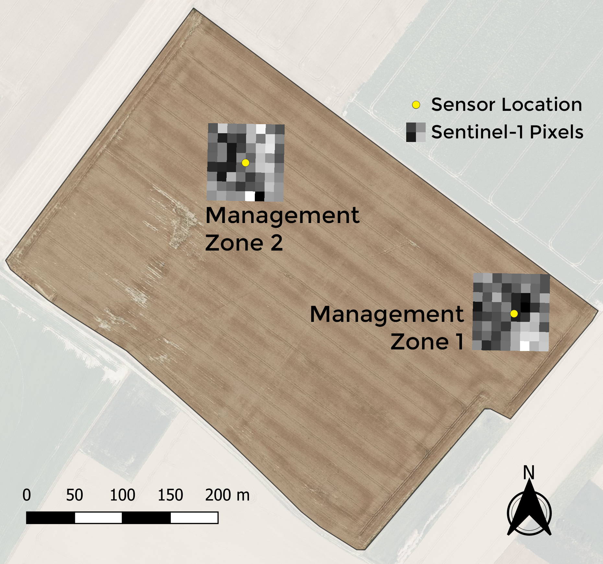
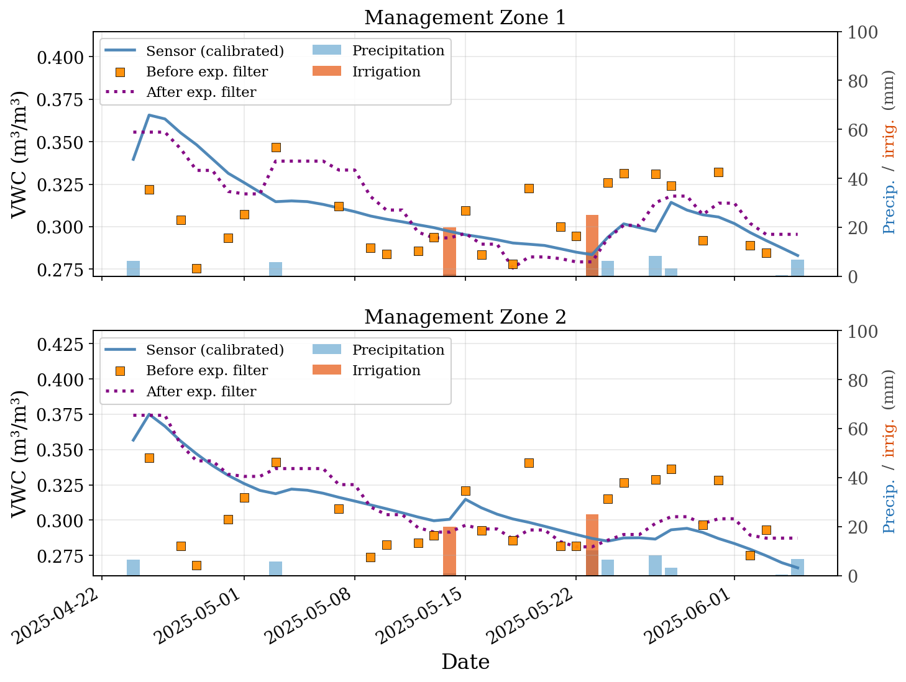
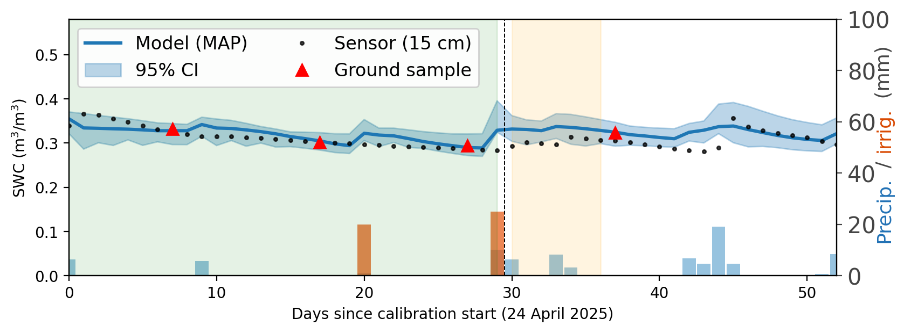
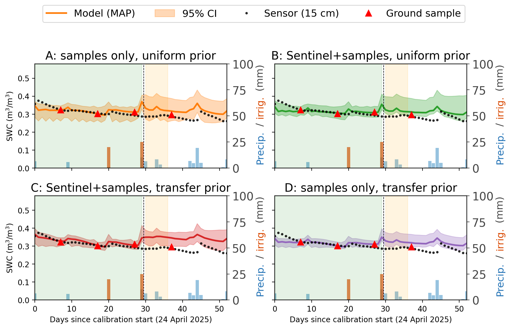
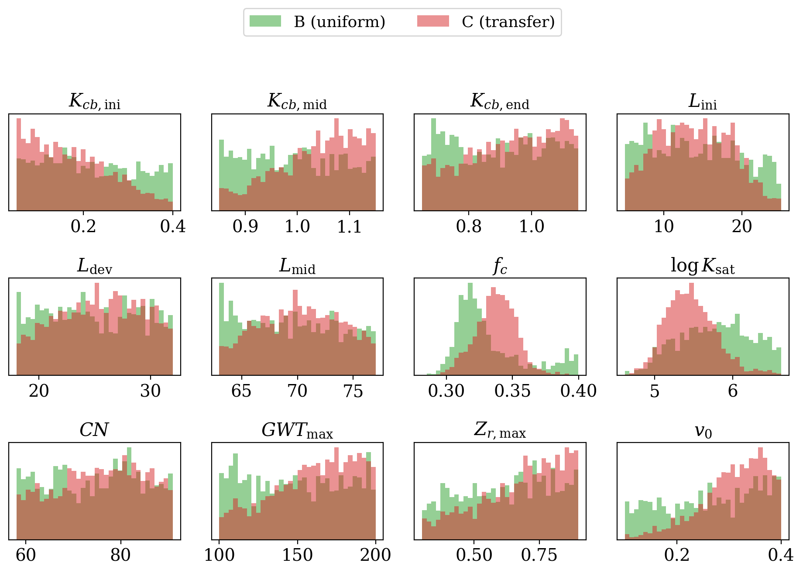

# SentinelProc: Sentinel-1 Soil Moisture Retrieval & Bayesian Assimilation into SWIM²

Code for the completion of the Master's thesis **"Spatially Distributed Soil Moisture Modeling: Integrating Sentinel-1 SAR into the SWIM² Digital Twin"** at KU Leuven / VUB (IUPWARE Master of Science in Water Resources Engineering).

---

## Overview

This repository retrieves soil moisture from Sentinel-1 SAR data over an agricultural field in Hélécine, Belgium, and assimilates it into the **SWIM²** Bayesian soil-water-balance framework. Five configurations of knowledge transfer between management zones are compared:

| Config | Zone | Observations | Prior |
|--------|------|-------------|-------|
| **Ref** | MZ1 | Sensor + samples | Uniform |
| **2a** | MZ2 | Samples only | Uniform |
| **2b** | MZ2 | Sentinel-1 + samples | Uniform |
| **2c** | MZ2 | Sentinel-1 + samples | Transfer from MZ1 |
| **2d** | MZ2 | Samples only | Transfer from MZ1 |

The **novel contribution** is the prior transfer mechanism: the full inflated posterior covariance of a sensor-equipped zone (MZ1) serves as the informative prior for an adjacent, data-sparse zone (MZ2), with or without the Sentinel-1 observation. This is the spatial analogue of a seasonal prior, first proposed in the SWIM² framework (Hendrickx et al., 2025) but never implemented. Config 2c (transfer + Sentinel) achieved the highest validation efficiency (bcNSE = 0.89); config 2d (transfer alone) nearly matched it (bcNSE = 0.83), demonstrating that transferred knowledge can substitute for the satellite observation.

---

## Methodology

### Sentinel-1 DpRVIc Retrieval

Soil moisture is retrieved from Sentinel-1 GRD data using a **dual-polarimetric change-detection approach** based on the DpRVIc index (Bhogapurapu et al., 2021). The cross-polarisation ratio q = VH/VV is used to compute:

> DpRVIc = q × (q + 3) / (q + 1)²

which ranges from 0 (bare soil) to 1 (dense vegetation). A dry reference (minimum VV backscatter per pixel across the time series) is identified, and the change-detection variable Δσ is related to DpRVIc through an upper-envelope quadratic regression at the 98th percentile across 100 bins. The resulting surface soil moisture index Θ is spatially averaged over an 8×8 pixel (80×80 m) zone mask centred on each sensor station. Incidence angle effects from mixed ascending/descending orbits are normalised using the dynamic cosine-exponent method of Najem et al. (2024).

### Exponential Filter (SWI)

The surface index Θ is too noisy and shallow to represent root-zone moisture directly (R² < 0.01 against in-situ VWC). Following Wagner et al. (1999) and Albergel et al. (2008), an **exponential filter** propagates the surface signal to profile depth:

> SWI(t) = SWI(t−1) × e^(−t/T) + Θ(t) × (1 − e^(−t/T))

where T is a characteristic time constant optimised by cross-validation. The filtered SWI reproduces in-situ dynamics with R² = 0.78 (MZ1) and 0.85 (MZ2). A Deming regression (errors-in-both-variables) then calibrates the linear relationship VWC = a + b × SWI for each zone, providing the Sentinel observation equation and its error structure for the Bayesian assimilation.

### SWIM² Framework

**SWIM²** (Hendrickx et al., 2025) is a Bayesian inverse-modelling framework that calibrates a daily soil water balance (FAO-56 crop evapotranspiration, SCS curve-number runoff, root-zone storage) against observations using the **DREAM-ZS** Markov chain Monte Carlo sampler (Vrugt et al., 2009; Laloy and Vrugt, 2012). The observation error is modelled with a **block-diagonal covariance**: compound-symmetry matrices for the continuous sensor (σ²_α, σ²_ε) and Sentinel (σ²_α,S, σ²_ε,S) observations, and independent diagonal terms for the sporadic gravimetric samples. For the Sentinel configurations (2b, 2c), two additional calibration parameters (a_S, b_S) convert SWI to VWC inside the likelihood, so all residuals remain in VWC space. The prior transfer inflates the MZ1 posterior covariance by a factor of four and uses it as the prior for MZ2, following Scharnagl et al. (2011) and Rojas et al. (2008).

---

## Results

### Study Area

<p align="center">
  <br>
  <em>Study area: the onion field at Hélécine, Belgium (~330 m × 500 m), divided into two management zones from an ECa survey. A TEROS-10 capacitance sensor station (yellow marker) is installed at the centre of each zone, and the 80 × 80 m Sentinel-1 analysis window is centred on each station.</em>
</p>

### Exponential Filter Retrieval

<p align="center">
  <br>
  <em>Time series of DpRVIc (surface), filtered SWI, and in-situ sensor VWC for both management zones. The unfiltered surface index is uninformative for profile moisture (R² < 0.01); after applying the exponential filter, the SWI tracks in-situ VWC with R² = 0.78 (MZ1) and 0.85 (MZ2).</em>
</p>

### Reference Scenario (MZ1)

<p align="center">
  <br>
  <em>Reference scenario (MZ1, sensor + samples): calibration and validation at N = 30 days. The 95% credible interval (shaded) contains most of the held-out sensor record. Validation error at the optimum: bcRMSD = 0.016 m³/m³.</em>
</p>

### MZ2 Scenarios Comparison

<p align="center">
  <br>
  <em>Validation time series for the four MZ2 configurations at N = 30. Config 2c (transfer + Sentinel) achieves the tightest credible interval and highest bcNSE (0.89). Config 2d (transfer alone) reaches bcNSE = 0.83, demonstrating that transferred knowledge can substitute for the satellite observation.</em>
</p>

### Effect of Transfer Prior on Posteriors

<p align="center">
  <br>
  <em>Priors under uniform (dashed) vs transferred MZ1 posterior (solid) for the most sensitive parameters. The transfer concentrates the posteriors around physically plausible values, particularly at short calibration windows, and stabilises the calibration when data are sparse.</em>
</p>

---

## Repository Structure

```
sentinelproc/
├── process_all_scenes.py           # Download Sentinel-1 GRD time series
├── evalscript.js                   # Sentinel Hub evalscript (VV, VH, LIA, mask)
├── mask_farmland.py                # Clip rasters to field boundary
├── normalize_incidence.py          # Incidence angle normalisation (Najem 2024)
├── soil_moisture_field.py          # DpRVIc change-detection retrieval
├── exp_filter_retrieval.py         # Exponential filter → SWI + Deming regression
├── compute_deming_priors.py       # N-dependent Deming priors for config 2c
├── .env.template                   # Copernicus API credentials template
│
├── swim2/                           # SWIM² Bayesian calibration (DREAM-ZS)
│   ├── run_pipeline.py              #   Orchestrator: 5 configs × N windows
│   ├── run_parallel.py              #   Parallel runner (--workers N)
│   ├── SWB_model.py                 #   Soil water balance forward model
│   ├── mcmc.py                      #   DREAM-ZS sampler (Sampler class)
│   ├── mcmc_func.py                 #   Likelihood, prior, LHS, helpers
│   ├── Sensordata.py                #   In-situ + Sentinel observation handler
│   ├── swim2_data.py                #   Data loading (forcing, sensors, samples)
│   ├── covariance_analysis.py       #   Block-diagonal covariance matrices
│   ├── summarize_run.py             #   Post-run diagnostics
│   ├── make_results_figures.py      #   All thesis figures (Results & Appendix)
│   ├── crop_FAO.csv                 #   FAO crop coefficients for onion
│   └── Sensors_overview.xlsx        #   TEROS-10 sensor metadata
│
├── eto/                             # Reference ET from AgERA5
│   ├── download_era5.py    #   Download ERA5 data via CDS API
│   └── compute_eto.py     #   Compute ET₀ (PyETo, Penman-Monteith)
│
├── input/                           # Input data (see Data section below)
├── images/                          # Figures for this README
├── requirements.txt
└── README.md
```

---

## Quick Start

### Prerequisites

1. **Python 3.10+** and a virtual environment
2. **Copernicus Data Space account** for Sentinel-1 downloads
   - Register: https://documentation.dataspace.copernicus.eu/Registration.html
   - Create an OAuth client: https://documentation.dataspace.copernicus.eu/APIs/SentinelHub/Overview/Authentication.html
   - Copy `.env.template` to `.env` and fill in `CLIENT_ID` and `CLIENT_SECRET`
3. **CDS API key** for ERA5 data (optional, if re-downloading forcing data)
   - Follow https://cds.climate.copernicus.eu/api-how-to
   - Save key to `~/.cdsapirc`

### Install and Run

```bash
git clone https://github.com/adibmp137/sentinelproc.git
cd sentinelproc
python -m venv .venv && .venv\Scripts\activate      # Windows
pip install -r requirements.txt
```

**Sentinel-1 retrieval pipeline** (steps 1–6):

```bash
python process_all_scenes.py        # 1. Download Sentinel-1 GRD
python mask_farmland.py             # 2. Mask to field boundary
python normalize_incidence.py       # 3. Normalise incidence angle
python soil_moisture_field.py       # 4. DpRVIc retrieval → Θ
python exp_filter_retrieval.py      # 5. Exponential filter → SWI
python compute_deming_priors.py     # 6. Deming priors for config 2c
```

**SWIM² Bayesian calibration** (step 7):

```bash
cd swim2
python run_pipeline.py              # Run all 5 configs × 4 windows
python run_parallel.py --workers 4  # ...or in parallel
python make_results_figures.py      # Generate thesis figures
```

**(Optional) ET₀ computation** (if not using pre-computed `input/eto.csv`):

```bash
cd eto
python download_era5.py
python compute_eto.py
```

---

## Input Data

> **Privacy notice**: All data files in `input/` contain **filler/placeholder data only** (3 rows of zeros or structural stubs). The actual field data (sensor measurements, soil samples, irrigation records, coordinates, shapefiles) have been removed to protect the farmer's privacy.  
>  
> To replicate this work, you must replace these files with your own field data — see the table below for the required format and structure.

The `input/` directory should contain the following data when configured for your field:

| File | Description | Status |
|------|-------------|--------|
| `MZ1.csv` | MZ1 (sensor-equipped) half-hourly VWC | Placeholder — replace with your sensor data |
| `MZ2.csv` | MZ2 (validation) half-hourly VWC | Placeholder — replace with your sensor data |
| `ground_sample.csv` | Gravimetric soil moisture samples (DD/MM/YYYY) | Placeholder — replace with your samples |
| `eto.csv` | Daily reference ET | Placeholder — compute via `eto/compute_eto.py` |
| `precipitation.csv` | Daily precipitation | Placeholder — replace with your weather data |
| `irrigation.csv` | Irrigation events | Placeholder — replace with your irrigation records |
| `crop_FAO.csv` (in `swim2/`) | FAO crop coefficients | Included |

**Not included**: Raw ERA5 NetCDF files (re-download with `eto/download_era5.py`) and raw Sentinel-1 GeoTIFFs (re-download with `process_all_scenes.py`). You will also need to configure coordinates (UTM zone centers, bounding boxes, lat/lon) in the Python scripts before running.

---

## Requirements

See `requirements.txt` for the full dependency list. Key packages:

- **numpy**, **pandas**, **scipy**, **scikit-learn** — numerical computing
- **matplotlib** — figures
- **rasterio**, **geopandas**, **shapely** — geospatial processing
- **PyETo** — Penman-Monteith ET₀
- **cdsapi**, **netCDF4** — ERA5 data access
- **requests**, **requests-oauthlib** — Copernicus API
- **openpyxl** — Excel I/O
- **rosetta-soil** — pedotransfer functions

---

## Keywords

sentinel-1, SAR, soil moisture, DpRVIc, change detection, exponential filter, SWI, SWIM², DREAM-ZS, Bayesian inverse modelling, soil water balance, irrigation scheduling, precision agriculture, management zones, knowledge transfer, prior transfer, Hélécine, Belgium, MCMC, digital twin, variable rate irrigation, VRI, crop coefficient, FAO, field capacity, hydrology, remote sensing, C-band radar, GRD, polarization, volumetric water content, calibration, validation, Deming regression, block covariance, compound symmetry, posterior

---

## References

- Albergel, C., Rüdiger, C., Pellarin, T., Calvet, J.-C., Fritz, N., Froissard, F., Suquia, D., Petitpa, A., Piguet, B., and Martin, E.: From near-surface to root-zone soil moisture using an exponential filter, *Hydrology and Earth System Sciences*, 12, 1323–1337, 2008.
- Bhogapurapu, N., Dey, S., Homayouni, S., Bhattacharya, A., and Rao, Y.: Field-scale soil moisture estimation using Sentinel-1 GRD SAR data, *Advances in Space Research*, 70, 3845–3858, 2022.
- Hendrickx, M., Diels, J., Vanderborght, J., and Janssens, P.: Soil moisture modelling with SWIM²: Inverse modelling with soil moisture sensor data for improved predictions and irrigation scheduling, KU Leuven, 2025.
- Laloy, E. and Vrugt, J. A.: High-dimensional posterior exploration of hydrologic models using multiple-try DREAM(ZS) and high-performance computing, *Water Resources Research*, 48, W01526, 2012.
- Najem, S., Baghdadi, N., Bazzi, H., and Zribi, M.: Incidence angle normalisation of C-band radar backscattering coefficient over agricultural surfaces, *Remote Sensing*, 16, 3838, 2024.
- Scharnagl, B., Vrugt, J. A., Vereecken, H., and Herbst, M.: Inverse modelling of in situ soil water dynamics: investigating the effect of different prior distributions of the soil hydraulic parameters, *Hydrology and Earth System Sciences*, 15, 3043–3059, 2011.
- Vrugt, J. A., ter Braak, C. J. F., Diks, C. G. H., Robinson, B. A., Hyman, J. M., and Higdon, D.: Accelerating Markov chain Monte Carlo simulation by differential evolution with self-adaptive randomized subspace sampling, *International Journal of Nonlinear Sciences and Numerical Simulation*, 10, 273–290, 2009.
- Wagner, W., Lemoine, G., and Rott, H.: A method for estimating soil moisture from ERS scatterometer and soil data, *Remote Sensing of Environment*, 70, 191–207, 1999.
